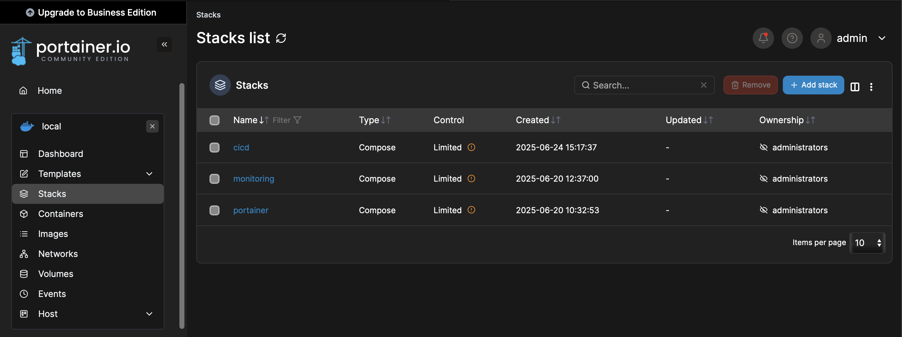
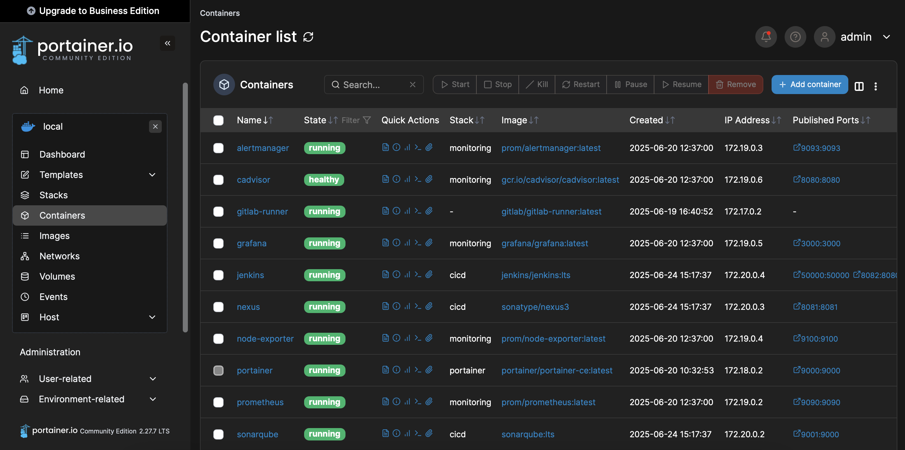

# DevOps Homelab

This is my personal **homelab** setup running inside a **Proxmox VM**, managing different infrastructure stacks such as **CI/CD**, **monitoring**, and **container orchestration**.
---

## Hardware

- **Host Machine Specs**
  - CPU: 8 cores
  - RAM: 8 GB
  - Host OS: Proxmox VE

- **Docker Host VM**
  - Allocated CPU: 2 cores
  - Allocated RAM: 4 GB
  - OS: Ubuntu Server
---

## Stack Overview

### 1. CI/CD Stack
Tools used:
- **Jenkins** – Automation server for pipelines and builds.
- **Nexus** – Artifact repository for Docker images, Maven/NPM packages, etc.
- **SonarQube** – Static analysis and code quality scanner.

### 2. Monitoring Stack
Tools used:
- **Prometheus** – Time-series database and monitoring system.
- **Alertmanager** – Handles alert notifications from Prometheus.
- **Grafana** – Dashboarding tool with pre-provisioned:
  - **Datasources** in `grafana/provisioning/datasources`
  - **Dashboards** in `grafana/provisioning/dashboards`

### 3. Container Management
- **Portainer** is used to manage all the above stacks via a simple web UI.




---

## Directory Structure

```bash
.
├── cicd
│   ├── jenkins
│   ├── nexus
│   └── sonarqube
├── monitoring
│   ├── alertmanager
│   ├── grafana
│   │   └── provisioning
│   │       ├── dashboards
│   │       └── datasources
│   └── prometheus
└── portainer
```
---

## Usage

```bash
git clone https://github.com/vishnumohanan404/homelab.git
cd homelab
```
---

## Security & Access
- Services are running inside a private Proxmox VM with no direct internet exposure
- All tools are secured with internal credentials

## Contributions
This project is personal, but ideas and improvements are welcome. Feel free to fork or open an issue!

## License
MIT – Feel free to reuse or adapt this homelab setup.
